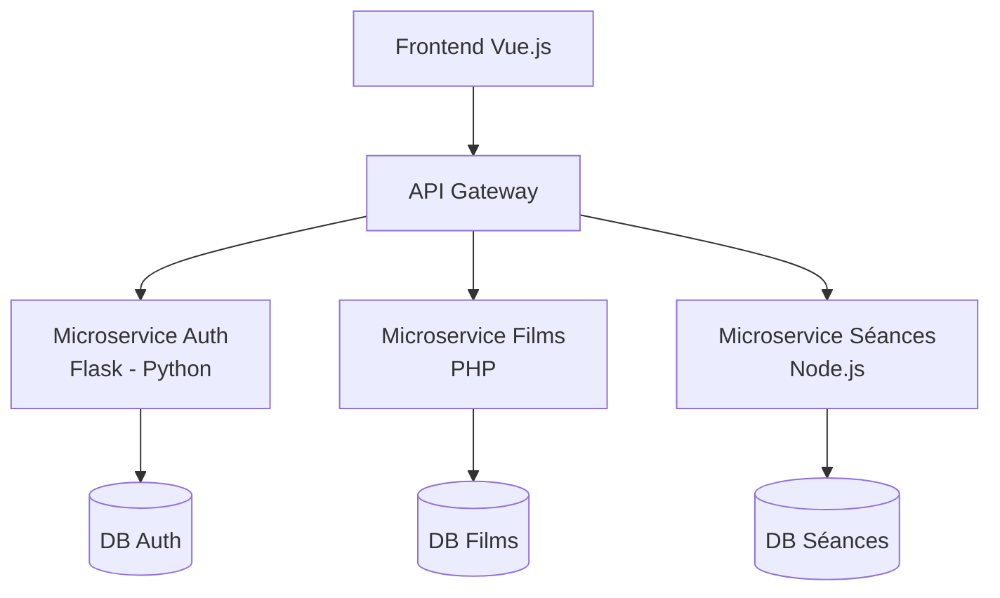

# 🎬 CENTRAL CINEMA — Application de réservation de billets de cinéma

---

## 📌 Présentation du projet

**CENTRAL CINEMA** est une application Web de réservation de billets de cinéma développée dans le cadre d’un **projet noté** sur l’architecture **microservices**.

L’objectif est de concevoir une application complète permettant :

* la gestion des films à l’affiche,
* la gestion des séances de cinéma,
* la gestion des utilisateurs,
* la réservation de places avec contrôle des disponibilités.

L’application est accessible depuis un navigateur web et s’exécute en local ou sur un serveur gratuit.

---

## 🧩 Architecture générale

L’application repose sur une **architecture microservices**, avec une séparation claire entre le frontend et le backend.

### 📊 Diagramme d’architecture (API Gateway & Microservices)



### 🔍 Lecture du schéma

* Le **frontend Vue.js** communique uniquement avec l’**API Gateway**
* L’API Gateway redirige les requêtes vers le microservice concerné
* Chaque microservice possède sa **propre base de données**

👉 Cette architecture garantit une forte séparation des responsabilités et une meilleure évolutivité.

---

## 🧪 Microservices

### 🔐 Microservice Authentification & Utilisateurs

* **Technologie** : Python / Flask
* **Responsabilités** :

  * Inscription des utilisateurs
  * Connexion / Déconnexion
  * Gestion des rôles (admin / client)
  * Génération et validation des tokens JWT

---

### 🎞️ Microservice Catalogue de Films

* **Technologie** : PHP
* **Responsabilités** :

  * Ajouter / Modifier / Supprimer des films
  * Informations : nom, genre, durée, année, réalisateur
  * Consultation des films à l’affiche

---

### 📅 Microservice Séances

* **Technologie** : Node.js
* **Responsabilités** :

  * Gestion des séances associées à un film
  * Informations : salle, horaire, nombre de places
  * Vérification des places restantes
  * Réservation de places

---

## 🗄️ Bases de données

Chaque microservice dispose de **sa propre base de données**, garantissant :

* une indépendance forte,
* une meilleure scalabilité,
* une maintenance facilitée.

> Le moteur de base de données peut être identique entre les services, mais les schémas sont séparés.

---

## 🖥️ Frontend

### Technologie

* **Framework** : Vue.js 3
* **Bundler** : Vite
* **State Management** : Pinia
* **Routing** : Vue Router
* **Style** : Tailwind CSS

### Rôles du frontend

* Interface utilisateur (UI / UX)
* Appels à l’API Gateway via Axios
* Gestion du token JWT
* Navigation selon le rôle utilisateur

---

## 🔁 Communication Frontend ↔ Backend

Toutes les requêtes passent par l’API Gateway.

Exemples :

| Action      | Méthode | Endpoint                  |
| ----------- | ------- | ------------------------- |
| Connexion   | POST    | `/api/auth/login`         |
| Films       | GET     | `/api/movies`             |
| Séances     | GET     | `/api/sessions`           |
| Réservation | POST    | `/api/sessions/{id}/book` |

Le token JWT est automatiquement ajouté dans les requêtes via un interceptor Axios.

---

## 🔐 Authentification

* Authentification basée sur **JWT**
* Le token est stocké côté client (localStorage)
* Les routes protégées nécessitent un token valide
* Redirection automatique vers `/login` en cas de token invalide

---

## 🎨 Choix graphiques (UI / UX)

L’interface a été conçue avec les objectifs suivants :

* 🎬 Thème cinéma
* 🎨 Palette de couleurs bleutées
* 🧘‍♂️ Design simple, chic et confortable
* 🚀 Navigation fluide et moderne

### Technologies UI

* Tailwind CSS
* Layout responsive (mobile / desktop)
* Animations légères

---

## 🚀 Lancement du projet

### Frontend

```bash
npm install
npm run dev
```

### Backend

Chaque microservice se lance indépendamment selon sa technologie.

---

## 🎓 Objectifs pédagogiques

* Comprendre l’architecture microservices
* Utiliser plusieurs technologies backend
* Mettre en place une API Gateway
* Séparer frontend et backend
* Gérer l’authentification JWT

---

## 👥 Répartition du travail

* Microservice Auth : Python / Flask
* Microservice Films : PHP
* Microservice Séances : Node.js
* Frontend : Vue.js

---

## 📎 Conclusion

Ce projet met en œuvre une architecture moderne et modulaire, proche des standards utilisés en entreprise, tout en restant adaptée à un contexte pédagogique.

---

🎬 **CENTRAL CINEMA — Projet Microservices**
